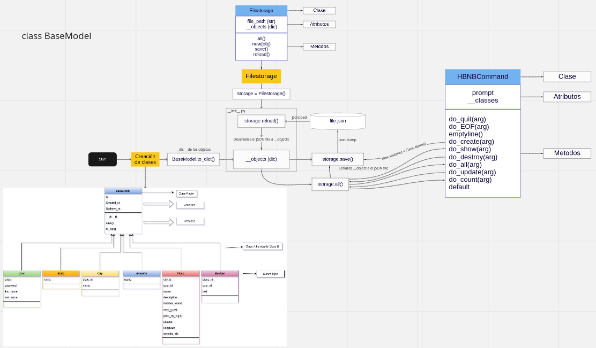
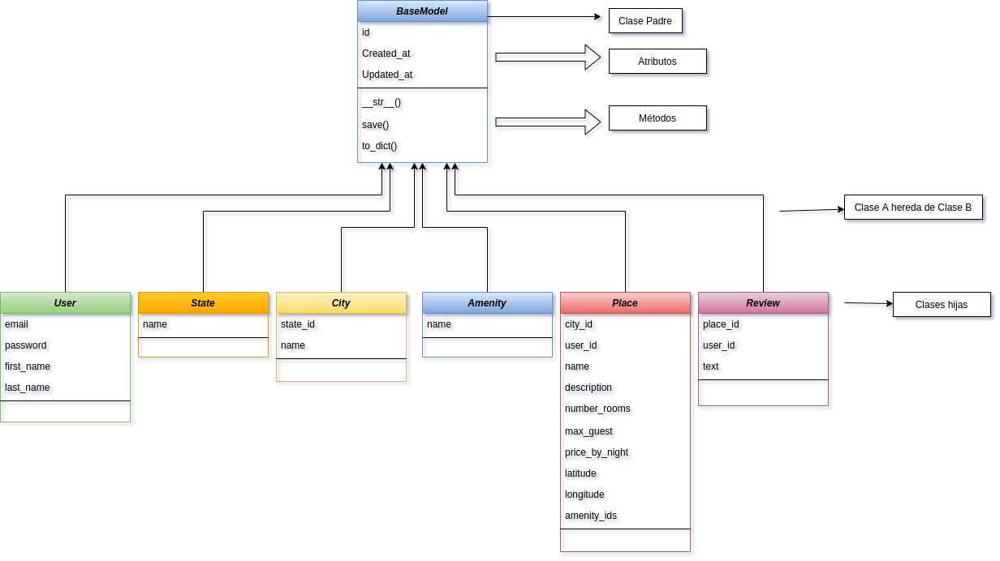
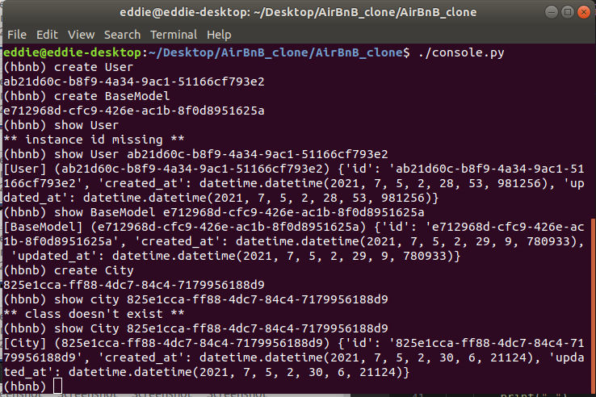
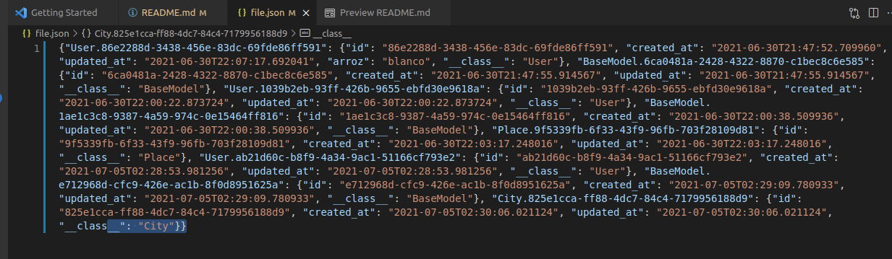

<p align="center">

</p>

# AirBnB_clone
Airbnb clone is an online solution that helps in building full-fledged and outstanding online rental platform like Airbnb. This is because a readymade Airbnb clone will include all significant features to arrive at an impressive online rental platform quickly and easily. A dynamically adaptable Airbnb clone solution will suit multitudinous online rental business models and concepts. So, whatever may be rental business ideas like a vacation rental, boat rental, vehicle rental, equipment rental, etc, you can give wings to your dreams with a versatile Airbnb clone. To say in a nutshell, to materialize your online rental business dreams within your budget and a short timeframe, there is no better option other than to go for a ready-to-use and comprehensive Airbnb clone solution.
## Installation
Use the git clone to install this project
```bash
$ git clone https://github.com/01Eddie/AirBnB_clone.git
```
## Compilation
Your code will be compiled this way:
```bash
$ chmod u+x [name_of_file].py
```
The build will create a file with (hbnb), then continue to run the following commands.
```bash
$ (hbnb) 
$ 
```
## Algorithm

<p align="center">

</p>

<p align="center">

</p>

## Example

<p align="center">

</p>

<p align="center">

</p>

## Builtins

`quit` - Finish the program
```
(hbnb) quit
user@user$
```

`create` - Create a new instance of a given class and print it's id.
```
(hbnb) create User
(hbnb) 38061c60-62a9-45c8-989f-162bd4e45751
```

`show` - Prints the string representation of an instance based on the class name and id.
```
(hbnb) show User 38061c60-62a9-45c8-989f-162bd4e45751
[User] (38061c60-62a9-45c8-989f-162bd4e45751) {'updated_at': datetime.datetime(2021, 7, 6, 23, 33, 47,     834978), 'created_at': datetime.datetime(2021, 7, 6, 23, 33, 47, 834978), 'id': '38061c60-62a9-45c8-989f-162bd4e45751'}
```

`destroy` - Deletes an instance based on the class name and id.
```
(hbnb) destroy User 38061c60-62a9-45c8-989f-162bd4e45751
(hbnb) show User 38061c60-62a9-45c8-989f-162bd4e45751
** no instance found **
```

`all` - Prints all string representation of all instances or of a given class as argument.
```
(hbnb) all
["[BaseModel] (c3717483-cb78-4549-9b72-a17021b9fb34) {'updated_at': datetime.datetime(2021, 7, 6, 23, 42, 8, 129837), 'created_at': datetime.datetime(2021, 7, 6, 23, 42, 8, 129837), 'id': 'c3717483-cb78-4549-9b72-a17021b9fb34'}", "[BaseModel] (e9aa04d3-037e-4032-84a9-1b5ba2971db1) {'updated_at': datetime.datetime(2021, 7, 6, 22, 18, 8, 957981), 'created_at': datetime.datetime(2021, 7, 6, 22, 18, 8, 957981), 'id': 'e9aa04d3-037e-4032-84a9-1b5ba2971db1'}", "[Place] (32c5e627-9b44-45f5-bede-a62d380312e8) {'updated_at': datetime.datetime(2021, 7, 6, 23, 42, 3, 548463), 'created_at': datetime.datetime(2021, 7, 6, 23, 42, 3, 548463), 'id': '32c5e627-9b44-45f5-bede-a62d380312e8'}", "[User] (73e71a85-78ee-43f1-9afc-6723d8d4e9f4) {'updated_at': datetime.datetime(2021, 7, 6, 23, 40, 44, 312907), 'created_at': datetime.datetime(2021, 7, 6, 23, 40, 44, 312907), 'id': '73e71a85-78ee-43f1-9afc-6723d8d4e9f4'}", "[User] (f561f599-3294-416b-b82a-79b7b8dc6990) {'updated_at': datetime.datetime(2021, 7, 6, 23, 41, 33, 744653), 'created_at': datetime.datetime(2021, 7, 6, 23, 41, 33, 744653), 'id': 'f561f599-3294-416b-b82a-79b7b8dc6990'}", "[User] (df3d364b-6dfb-40f3-80e9-339ceb4c5d84) {'updated_at': datetime.datetime(2021, 7, 6, 23, 41, 35, 439194), 'created_at': datetime.datetime(2021, 7, 6, 23, 41, 35, 439194), 'id': 'df3d364b-6dfb-40f3-80e9-339ceb4c5d84'}", "[Place] (eca7f0a8-5f8f-4865-85a9-d9417a76732f) {'updated_at': datetime.datetime(2021, 7, 6, 23, 41, 18, 78761), 'created_at': datetime.datetime(2021, 7, 6, 23, 41, 18, 78761), 'id': 'eca7f0a8-5f8f-4865-85a9-d9417a76732f'}"]
(hbnb) all User
["[User] (73e71a85-78ee-43f1-9afc-6723d8d4e9f4) {'updated_at': datetime.datetime(2021, 7, 6, 23, 40, 44, 312907), 'created_at': datetime.datetime(2021, 7, 6, 23, 40, 44, 312907), 'id': '73e71a85-78ee-43f1-9afc-6723d8d4e9f4'}", "[User] (f561f599-3294-416b-b82a-79b7b8dc6990) {'updated_at': datetime.datetime(2021, 7, 6, 23, 41, 33, 744653), 'created_at': datetime.datetime(2021, 7, 6, 23, 41, 33, 744653), 'id': 'f561f599-3294-416b-b82a-79b7b8dc6990'}", "[User] (df3d364b-6dfb-40f3-80e9-339ceb4c5d84) {'updated_at': datetime.datetime(2021, 7, 6, 23, 41, 35, 439194), 'created_at': datetime.datetime(2021, 7, 6, 23, 41, 35, 439194), 'id': 'df3d364b-6dfb-40f3-80e9-339ceb4c5d84'}"]
```

`update` - Updates an instance based on the class name and id by adding or updating an existing attribute.
```
(hbnb) show User 73e71a85-78ee-43f1-9afc-6723d8d4e9f4
[User] (73e71a85-78ee-43f1-9afc-6723d8d4e9f4) {'updated_at': datetime.datetime(2021, 7, 6, 23, 40, 44, 312907), 'created_at': datetime.datetime(2021, 7, 6, 23, 40, 44, 312907), 'id': '73e71a85-78ee-43f1-9afc-6723d8d4e9f4'}
(hbnb) update User 73e71a85-78ee-43f1-9afc-6723d8d4e9f4 pet parrot
(hbnb) show User 73e71a85-78ee-43f1-9afc-6723d8d4e9f4
[User] (73e71a85-78ee-43f1-9afc-6723d8d4e9f4) {'id': '73e71a85-78ee-43f1-9afc-6723d8d4e9f4', 'updated_at': datetime.datetime(2021, 7, 6, 23, 45, 34, 756634), 'created_at': datetime.datetime(2021, 7, 6, 23, 40, 44, 312907), 'pet': 'parrot'}
```

## Authors
Eddie Huaripayta <eddiejesus1197@gmail.com>

Luis Escobedo <lescobedo.im@gmail.com>
